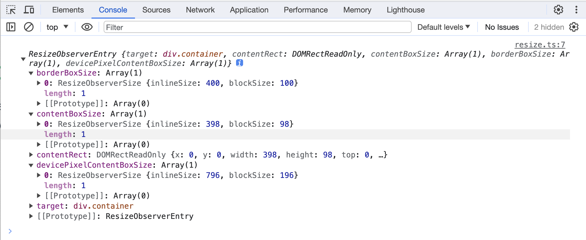

### ResizeObserver

ResizeObserver 坚实 Element 内容盒或边框盒或者 SVGElement 边界尺寸的变化

```ts
const resizeObserver = new ResizeObserver((entries) => {
  for(const entry of entries) {

  }
})
```

entry



#### 方法

**ResizeObserver.disconnect()** 取消特定观察者目标上所有对 Element 的监听

**ResizeObserver.observe()** 开始对指定 Element 的监听

**ResizeObserver.unobserve()** 结束对指定 Element 的监听


### resize 指令

```vue
<script setup lang="ts">
import { ref } from 'vue';

const size = ref('')

const handleSizeChange = ([width, height]: [string, string]) => {
  size.value = width + ' * ' + height
}


</script>

<template>
  <div class="container" v-resize="handleSizeChange">
    {{ size }}
  </div>
</template>

<style lang="scss" scoped>
.container {
  width: 400px;
  height: 100px;
  display: flex;
  align-items: center;
  justify-content: center;
  border: 1px solid red;
  overflow: hidden;
  resize: both;
}
</style>
```

directives/resize.ts

```ts
import type { DirectiveBinding } from "vue"

const map = new WeakMap()

const ob = new ResizeObserver((entries) => {
  for (const entry of entries) {
    let handler = map.get(entry.target)
    if (typeof handler == 'function') {
      handler([
        entry.borderBoxSize[0].blockSize,
        entry.borderBoxSize[0].inlineSize
      ])
    }
  }
})


export default {
  mounted(el: HTMLElement, binding: DirectiveBinding) {
    map.set(el, binding.value)
    ob.observe(el)
  },
  unMounted(el: HTMLElement) {
    ob.unobserve(el)
  }
}
```

### css resize 属性

resize 属性规定是否可由用户调整元素的尺寸

注意：如果需要 resize 属性生效，需要设置元素的 overflow 属性，值可以是 auto、hidden 或 scroll

resize: none|both|horizontal|vertical

默认值: none，继承性：no，js：object.style.resize = 'both'

